<div align="center">


# Easy Flatpak

**A friendly, modern GUI for installing and managing Flatpak applications on Linux.**

[](https://flathub.org/en/apps/org.dupot.easyflatpak)
[](LICENSE)
[](https://github.com/imikado/dupotEasyFlatpak/releases)

[Flathub](https://flathub.org/en/apps/org.dupot.easyflatpak) · [Website](https://www.dupot.org/desktop.html) · [Report a bug](https://github.com/imikado/dupotEasyFlatpak/issues)

</div>

---

Easy Flatpak wraps the `flatpak` command line in a clean [GTK4 + libadwaita](https://gnome.org) interface, so installing, updating and managing apps never needs a terminal. Browse Flathub, install from GitHub releases or local `.flatpak` files, set up extra repositories, and let **recipes** pre-configure tricky apps (like Steam) for you automatically.

## 📦 Install

<div align="center">

<a href="https://flathub.org/en/apps/org.dupot.easyflatpak">
  
</a>

</div>

```bash
flatpak install flathub org.dupot.easyflatpak
```

> Already have a Flatpak build in hand? `flatpak install --user org.dupot.easyflatpak.flatpak`

## ✨ Features

- **Browse & search** Flathub's full catalog — trending, popular, apps of the week, by category, or free text search
- **One-click install** straight from the grid, with parallel installs tracked in a live Pending queue
- **Recipes**: guided setup for apps that need extra configuration before they work well — e.g. Steam, Lutris, Heroic, Bottles — asks for a games folder once and reuses it everywhere
- **Bundles**: install a curated group of applications in one go
- **Downgrade & pin**: roll back to a previous version and pin it so it's skipped on future updates
- **Install anything**: local `.flatpak` files, GitHub projects that publish `.flatpak` release assets, or your own custom/OCI Flatpak repositories
- **Import / Export**: back up your installed apps (with their install scope and permission overrides) and restore them on another machine
- **Permission overrides**: edit an app's filesystem access without touching the terminal
- **User & system scope** support, with architecture filtering
- **Maintenance tools**: clean cache, repair permissions, right from the menu
- **Light & dark themes**, following your system preference

## 🌍 Available languages

English · Français · Español · Italiano · Português (BR) · العربية · Română · Deutsch

## 📸 Screenshots

<table>
<tr>
<td align="center" width="50%">
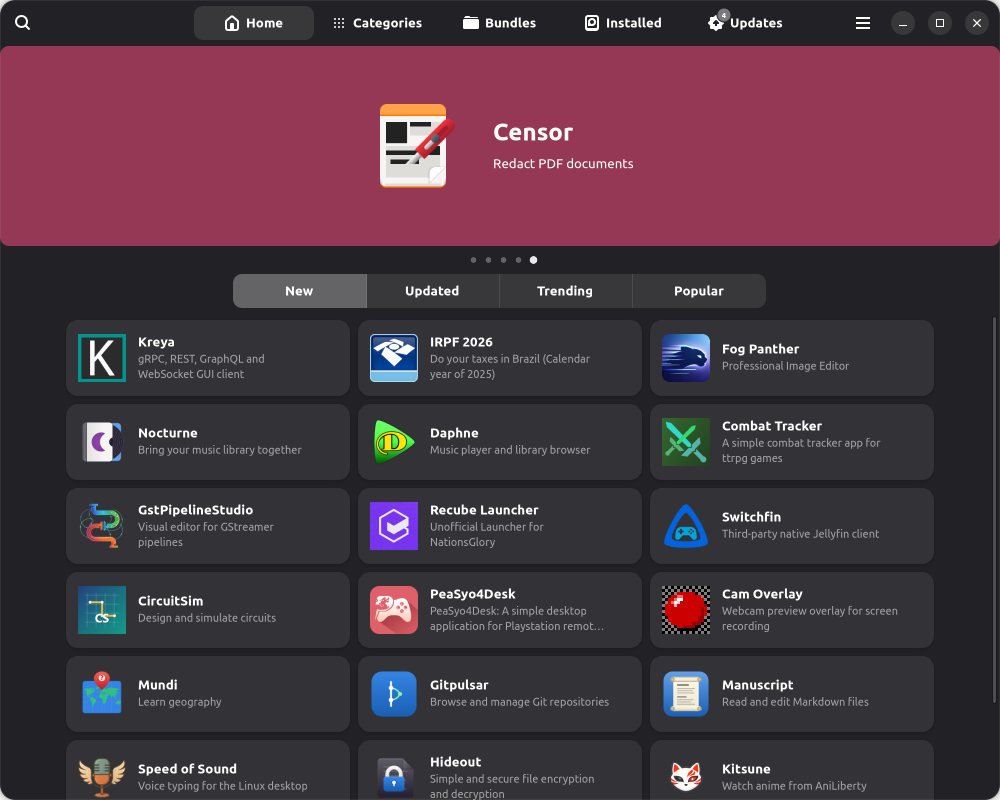<br><sub>Home</sub>
</td>
<td align="center" width="50%">
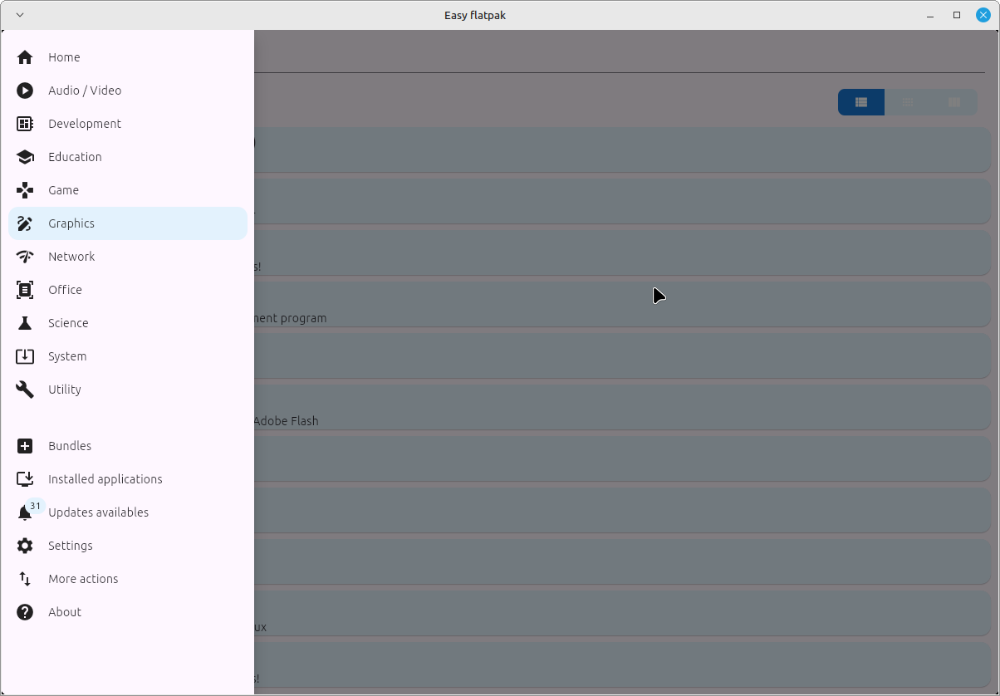<br><sub>Browse by category</sub>
</td>
</tr>
<tr>
<td align="center" width="50%">
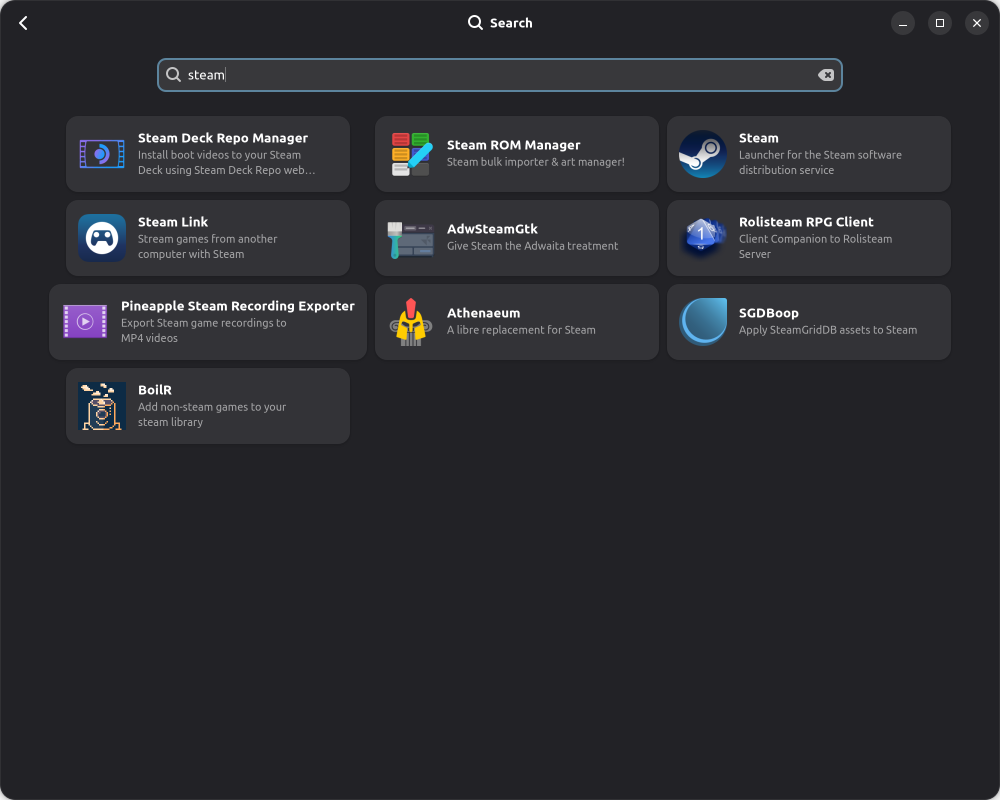<br><sub>Search</sub>
</td>
<td align="center" width="50%">
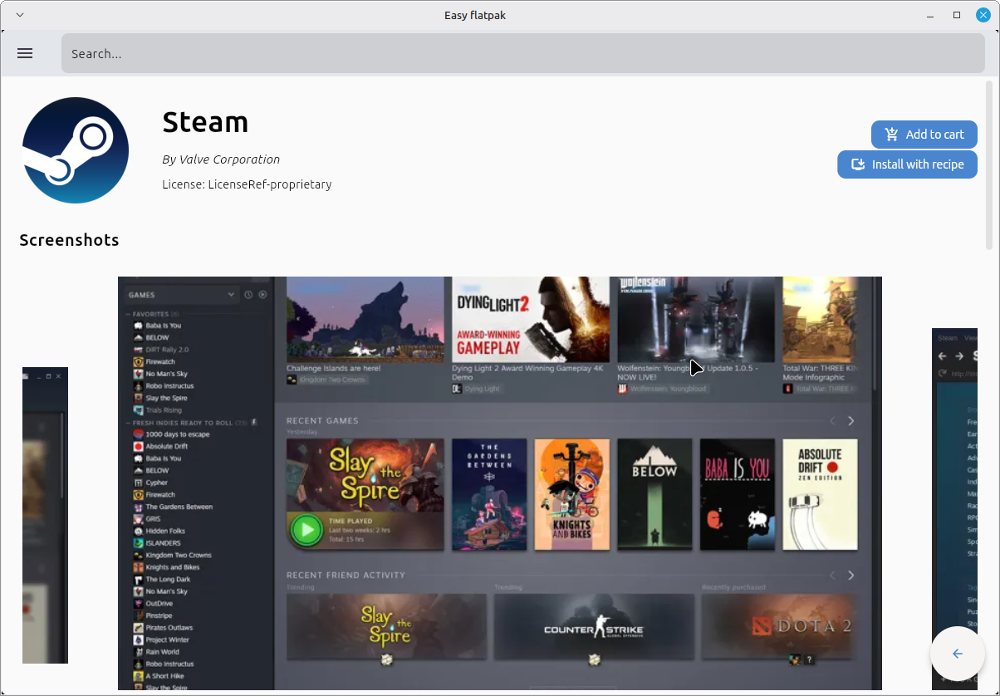<br><sub>Application detail</sub>
</td>
</tr>
<tr>
<td align="center" width="50%">
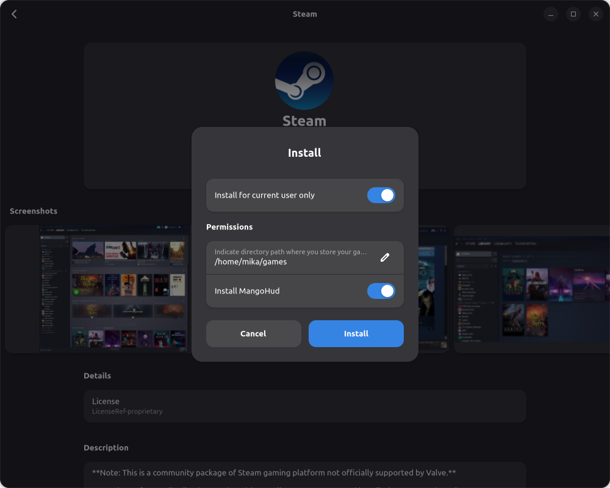<br><sub>Recipe-guided install (Steam)</sub>
</td>
<td align="center" width="50%">
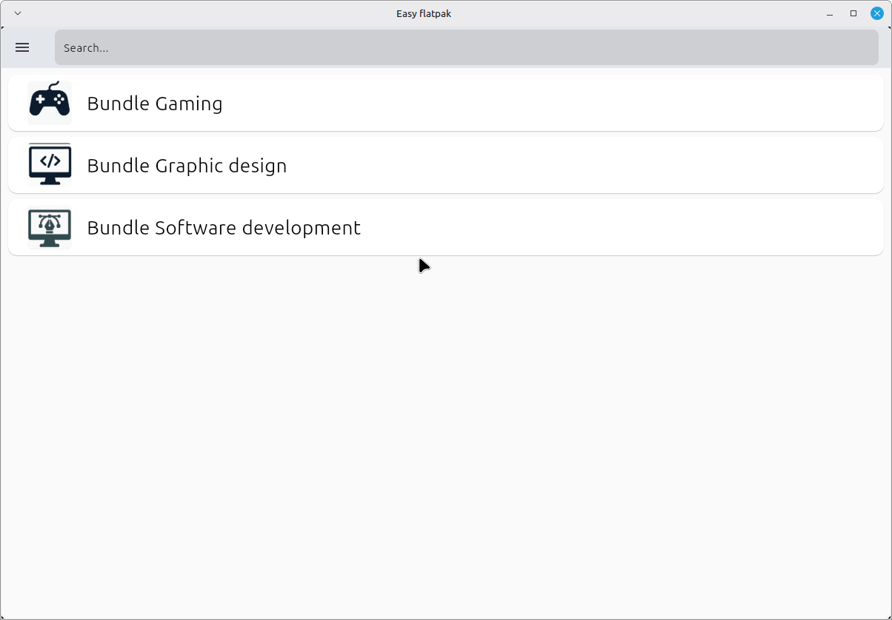<br><sub>Bundles</sub>
</td>
</tr>
<tr>
<td align="center" width="50%">
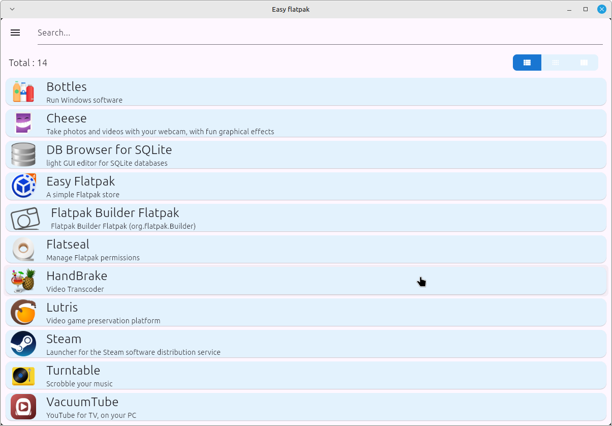<br><sub>Installed applications</sub>
</td>
<td align="center" width="50%">
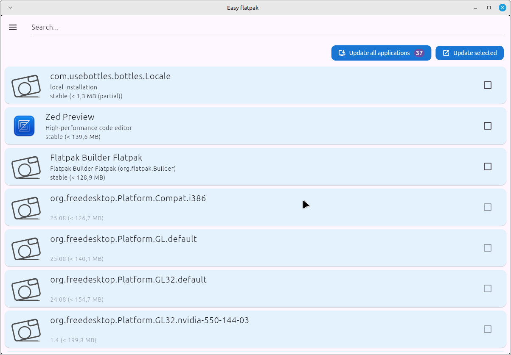<br><sub>Available updates</sub>
</td>
</tr>
<tr>
<td align="center" width="50%">
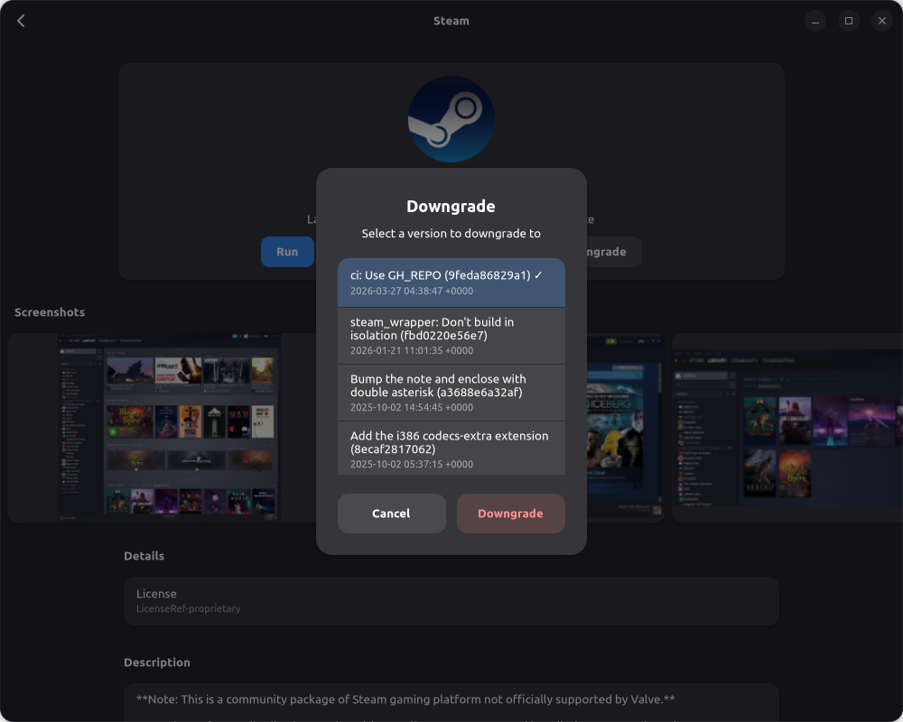<br><sub>Downgrade a version</sub>
</td>
<td align="center" width="50%">
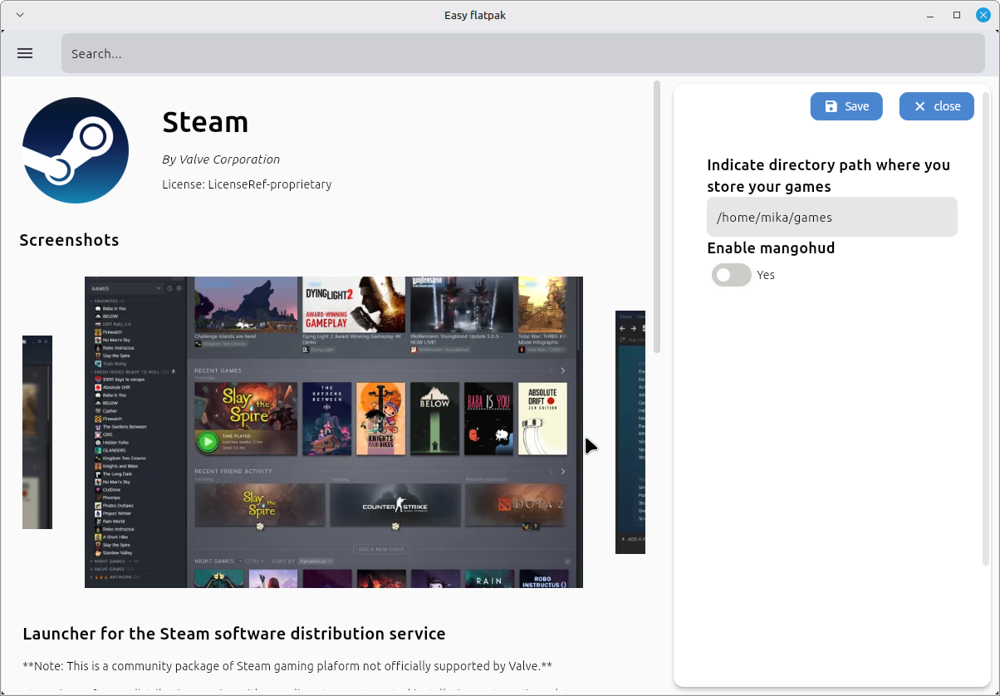<br><sub>Permission overrides</sub>
</td>
</tr>
<tr>
<td align="center" width="50%">
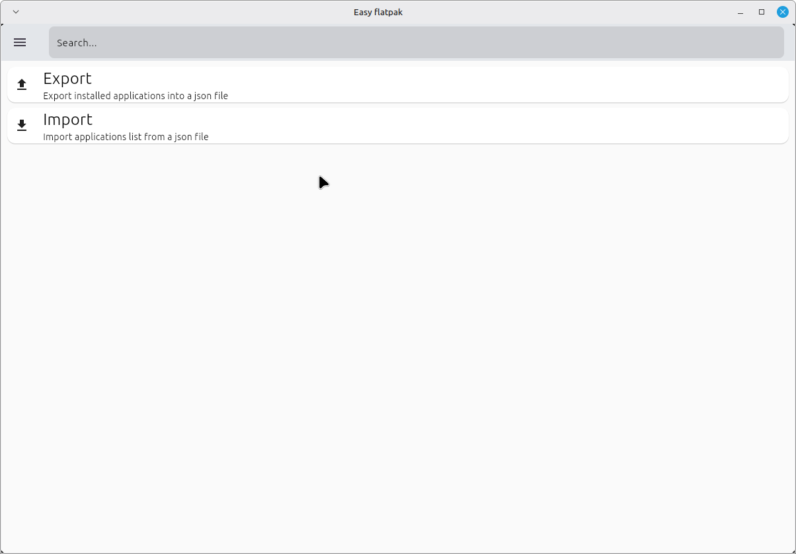<br><sub>Import / export installed apps</sub>
</td>
<td align="center" width="50%">
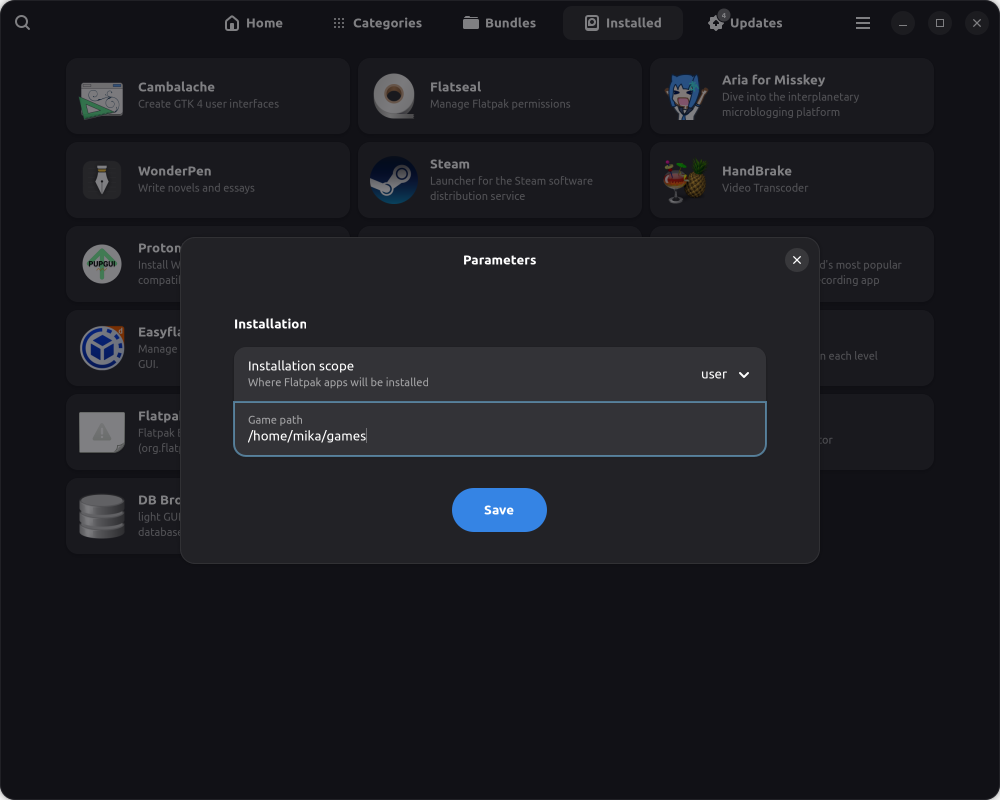<br><sub>Settings</sub>
</td>
</tr>
</table>

## 🛠️ Building from source

Requires Python 3, GTK4 and libadwaita (and their GObject introspection bindings).

```bash
git clone https://github.com/imikado/dupotEasyFlatpak.git
cd dupotEasyFlatpak
make run              # launch straight from source
# or
make install          # install system-wide (PREFIX=/usr/local by default)
```

After adding or changing translatable strings, regenerate the `.po`/`.mo` files:

```bash
./generate_translations.sh
```

## 🤝 Contributing

Issues and pull requests are welcome — see the [issue tracker](https://github.com/imikado/dupotEasyFlatpak/issues).

## 📄 License

[LGPL-2.1](LICENSE)
